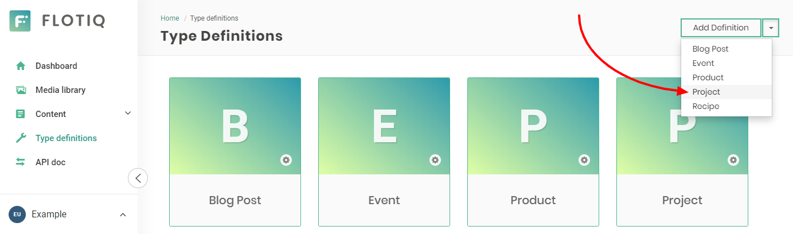
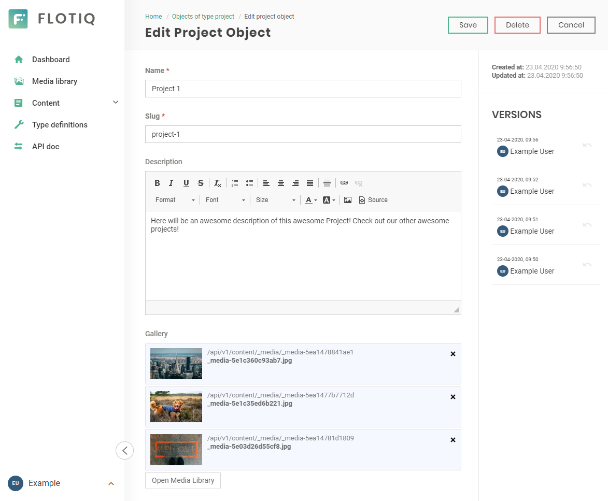

<a href="https://flotiq.com/">
    
</a>

Scully Starter - Projects
========================

This is a [Scully](https://scully.io/) starter project for a projects website. It's configured to pull projects data from [Flotiq](https://flotiq.com) and can be easily deployed to your cloud hosting - Heroku, Netlify, etc.

Live Demo: https://vibrant-mclean-8da635.netlify.app/

Screenshot


This project was generated with [Angular CLI](https://github.com/angular/angular-cli) version 11.0.2.

## Quick start

1. **Clone project**

    ```bash
   git clone https://github.com/flotiq/scully-projects-starter
   ```

1. **Setup "Project" Content Type in Flotiq**

   Create your [Flotiq.com](https://flotiq.com) account. Next, create the `Project` Content Type:

   
    
   _Note: You can also create `Project` using [Flotiq REST API](https://flotiq.com/docs/API/)._ 

1. **Configure application**
    
    The next step is to configure our application to know from where it has to fetch the data.
    
    In `src/environments/environment.prod.ts` and in `src/environments/environment.js` change `YOUR_FLOTIQ_API_KEY` to Read only Flotiq API key.
    
    Remember to change them back to `YOUR_FLOTIQ_API_KEY` before committing code to repository.
    
1.  **Start developing**

    ```sh
        cd scully-projects-starter/
        npm install
    ```
    If you wish to import example projects to your account install [flotiq-cli](https://github.com/flotiq/flotiq-cli), and run in project directory:
            
    ```sh
        flotiq import [flotiqApiKey] .
    ```
    
    It will add 9 images and 3 projects to your Flotiq account.
        
    _Note: You need to put your Read and write API key in `src/environments/environment.js` for import to work. You don't need Project content type in your account. If you already have projects with ids `project-1`, `project-2` they will be overwritten._

    Run `ng serve` for a dev server. Navigate to `http://localhost:4200/`. The app will automatically reload if you change any of the source files.

    If you wish to add new elements to the project run `ng generate component component-name` to generate a new component. You can also use `ng generate directive|pipe|service|class|guard|interface|enum|module`.

    Run `ng build` to build the project. The build artifacts will be stored in the `dist/` directory. Use the `--prod` flag for a production build.
    
    To build the static version with Scully run:
    
    ```sh
    npm run build --prod
    npm run scully -- --scanRoutes
    npm run scully serve
    ```
    
    This will start the Scully static server on `http://localhost:1668/`

1. **Manage your projects using Flotiq editor**
      
    You can now easily manage your projects using [Flotiq editor](https://editor.flotiq.com)
    
    

### Running unit tests

Run `ng test` to execute the unit tests via [Karma](https://karma-runner.github.io).

### Running end-to-end tests

Run `ng e2e` to execute the end-to-end tests via [Protractor](http://www.protractortest.org/).

### Further help with Angular

To get more help on the Angular CLI use `ng help` or go check out the [Angular CLI README](https://github.com/angular/angular-cli/blob/master/README.md).

## Deploy

  You can deploy this project to Netlify in 3 minutes:
  
  [](https://app.netlify.com/start/deploy?repository=https://github.com/flotiq/scully-projects-starter)


## Collaborating

   If you wish to talk with us about this project, feel free to hop on our [](https://discord.gg/FwXcHnX) .
   
   If you found a bug, please report it in [issues](https://github.com/flotiq/scully-projects-starter/issues).
